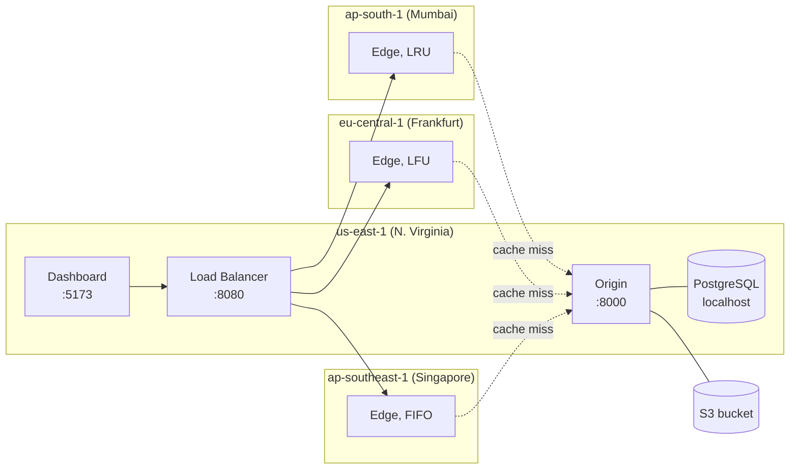
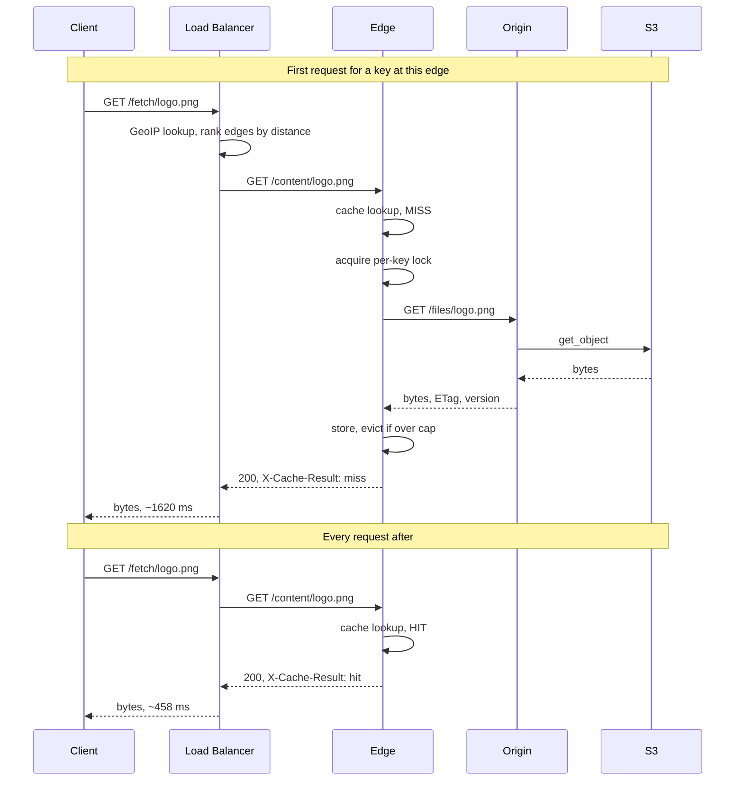

# Velocity CDN

A content delivery network built from the ground up: origin server, geo-distributed
edge caches, and the load balancer that routes between them. Deployed across four
AWS regions on four EC2 instances.

The components a CDN normally buys from a cloud provider are written here instead.
There is no CloudFront, no Application Load Balancer, and no ElastiCache in this
account. Nearest-edge selection, cache eviction, invalidation and failover are all
application code.

**Measured on the live deployment: a cache hit is 3.5x faster than a miss,
458 ms against 1620 ms at p50 over 541 requests from 24 client cities.**


Blue requests reach their nearest edge and return from its memory. The orange one is
a cache miss: it crosses to Virginia, and the edge stores what comes back so later
requests for that key are served locally.

## Contents

- [What it does](#what-it-does)
- [Results](#results)
- [Architecture](#architecture)
- [How a request is served](#how-a-request-is-served)
- [Dashboard](#dashboard)
- [Technology](#technology)
- [Project layout](#project-layout)
- [Running locally](#running-locally)
- [Testing](#testing)
- [Design decisions](#design-decisions)
- [Limitations](#limitations)

## What it does

| Capability | Implementation |
|---|---|
| Geo-routing | Client IP resolved through MaxMind GeoLite2, edges ranked by great-circle distance |
| Edge caching | Per-edge in-memory store with a byte cap, per-entry TTL, and pluggable eviction |
| Eviction policies | LRU, LFU and FIFO behind one interface, selected per edge by environment variable |
| Cache stampede protection | Per-key async lock so concurrent misses produce one origin fetch |
| Invalidation | Update or delete pushes a purge to every edge, per-edge result recorded |
| Failover | Health checks every 10 s; unhealthy edges leave rotation, traffic moves to the next-nearest |
| Stale-while-revalidate | Expired entry plus unreachable origin returns the stale copy with `Warning: 110` |
| Range requests | HTTP 206 served from cached bytes, so video seeks without downloading the whole file |
| Live dashboard | SSE request feed, hit-ratio trend, per-region latency, edge health, upload and playback |

## Results

541 requests from 24 client cities at 12 concurrent. Latency is recorded server-side
by the load balancer, so the client's own hop to us-east-1 is excluded.

| | p50 | p95 | n |
|---|---|---|---|
| Cache hit | **458 ms** | 1283 ms | 508 |
| Cache miss | 1620 ms | 3315 ms | 33 |

Broken down per edge, the geography shows up in the data:

| Edge | Region | Hit p50 | Miss p50 | Speedup |
|---|---|---|---|---|
| edge-frankfurt | eu-central-1 | **284 ms** | 977 ms | 3.4x |
| edge-mumbai | ap-south-1 | 741 ms | 2009 ms | 2.7x |
| edge-singapore | ap-southeast-1 | 836 ms | 2003 ms | 2.4x |

Frankfurt sits closest to the us-east-1 origin and pays the smallest miss penalty.
Singapore is furthest and pays the largest. That ordering was not configured; it is
propagation delay appearing in a database table.

**Throughput.** An edge serves 472 req/s from cache on a t4g.micro. End to end through
the load balancer the ceiling is roughly 95 req/s, and it is network-bound rather than
CPU-bound: concurrency past 10 only increases latency, because the transatlantic round
trip dominates. Scaling this system means adding edges closer to users, not larger
instances.

### Verified behaviour

Each of these was tested against the running system rather than assumed. Method and
raw output in [benchmark.md](benchmark.md).

| Claim | Result |
|---|---|
| Single-flight prevents stampede | 25 simultaneous misses produced 1 origin fetch |
| Eviction respects the byte cap | 1 MB cap against a 1.47 MB working set held occupancy at 88%, LRU evicted correctly |
| Update invalidates every edge | Re-upload, all three edges served the new content immediately |
| Failover on edge loss | Detected in ~25 s, next request served by the next-nearest edge, HTTP 200 |
| Stale-while-revalidate | Origin down with an expired entry served `Warning: 110`; an uncached key returned 502 |
| Range requests | Prefix, open-ended and suffix ranges all byte-exact against the source file |

## Architecture



Four `t4g.micro` instances. The load balancer, origin and dashboard run as three
containers on the us-east-1 box; each edge is a single container on its own instance
in its own region.

Every service is an independent process with its own memory, so cache hits and misses
are real rather than simulated. The origin is the only service holding database
credentials; the load balancer and edges reach persisted state through the origin's
`/internal/*` API. Edges register themselves on boot with their own URL and
coordinates, so a replaced instance rejoins without a manual database change.

## How a request is served



The path to the origin runs once per key per edge. Every later request for that key
is served locally and the origin never sees it.

### Cache outcomes

| Result | Meaning | Client receives the file |
|---|---|---|
| `hit` | Present in edge memory, within TTL | Yes, fast |
| `miss` | Fetched from origin, stored, then served | Yes, slow |
| `stale` | TTL expired and origin unreachable, old copy returned with `Warning: 110` | Yes, possibly outdated |
| `error` | 404 for an unknown key, 502 when the origin is down and nothing is cached | No |

A miss is not a failure. An entry becomes a miss when it has never been requested at
that edge, when its TTL expires, when it is evicted to make room, or when the edge
process restarts.

## Dashboard


Every panel reads live data.

**Try a request.** Choose a client city and a file. The result panel shows which edge
served it, hit or miss, size, round trip and the request ID that correlates the request
across all three services. The city list is generated by the load balancer using the
same ranking function the real routing path uses, so it cannot promise a route that
routing would not take.

**Origin files.** Upload, preview and delete. Uploads go through the origin API, which
writes S3 and the metadata row together. Video and audio play inline using range
requests against the edge, images and PDFs preview, and every file can be downloaded.

**Infrastructure.** The origin is shown above the edges, matching the direction a cache
miss travels, and reports Postgres and S3 separately so a half-broken origin appears as
degraded rather than healthy. Each edge shows its policy, occupancy against its cap, and
hit ratio.


## Technology

| Layer | Choice | Why |
|---|---|---|
| Services | Python 3.12, FastAPI, Uvicorn | async I/O suits a proxy that spends its time waiting on network |
| HTTP client | httpx | async client with connection pooling, used for every service-to-service call |
| Database | PostgreSQL 14 with SQLAlchemy 2 async and asyncpg | relational metadata plus the analytics the dashboard reads |
| Object storage | AWS S3 via boto3 | file bytes; the database holds only metadata |
| Geolocation | MaxMind GeoLite2 City with geoip2 | IP to coordinates, refreshed weekly by `geoipupdate` |
| Frontend | React 18, TypeScript, Vite, Tailwind, Recharts | small dashboard, no state library needed |
| Packaging | Docker, Docker Compose | one container per service, identical locally and in production |
| Infrastructure | AWS EC2 `t4g.micro` (ARM Graviton) across 4 regions | cheapest instances that give genuinely separate regions |

Deliberately not used: CloudFront, Application Load Balancer, ElastiCache, RDS,
Route 53. Each would have replaced a component that is the point of the project.

## Project layout

```
origin/                     Source of truth: S3 for bytes, Postgres for metadata
  app/routers/files.py        upload, download, delete, list
  app/routers/stats.py        aggregate queries behind every dashboard chart
  app/routers/internal.py     edge registration, request logging
  app/purge.py                invalidation fan-out to every edge
  app/storage.py              S3 access
  app/models.py               SQLAlchemy tables

edge/                       Cache node, one per region
  app/cache_manager.py        TTL, byte cap, single-flight lock
  app/cache/base.py           CachePolicy interface
  app/cache/{lru,lfu,fifo}.py three eviction strategies
  app/routers/content.py      serving, including HTTP range requests
  app/routers/internal.py     purge endpoint

load-balancer/              Routing brain
  app/routing.py              haversine distance, edge ranking
  app/routers/fetch.py        resolve location, rank, try each edge, log
  app/edge_registry.py        health-check loop, in-memory edge view
  app/geoip.py                MaxMind lookup, trusted-proxy handling
  app/routers/dashboard.py    analytics and file endpoints for the UI

frontend/                   React dashboard
  src/components/             one file per panel

db/init.sql                 Schema: files, edges, request_logs, cache_events,
                            invalidations, chaos_events
scripts/healthcheck.sh      22-check functional suite against any deployment
scripts/locustfile.py       Zipf-distributed load generator
docker-compose.yml          Local stack, including MinIO in place of S3
benchmark.md                Measurements, method, caveats
DEMO.md                     Walkthrough script for a live demo
SPEC.md                     The design document this was built from
```

Roughly 3,300 lines: 709 origin, 533 edge, 739 load balancer, 1,358 frontend.

## Running locally

Requires Docker and Docker Compose.

```bash
docker compose up --build
```

This starts Postgres, MinIO in place of S3, the origin, three edges, the load balancer
and the dashboard, each in its own container with its own memory.

| Service | URL |
|---|---|
| Dashboard | http://localhost:5174 |
| Load balancer | http://localhost:8080 |
| Origin | http://localhost:8000 |
| MinIO console | http://localhost:9011 (`minioadmin` / `minioadmin`) |

```bash
python3 scripts/seed_demo.py --count 20
curl "http://localhost:8080/fetch/demo/file-00.txt?region=mumbai" -D -
```

Run that fetch twice. The first returns `X-Cache-Result: miss`, the second `hit`.

GeoIP is optional locally. Without a GeoLite2 database the load balancer falls back to
the origin's region and the dashboard labels the option accordingly; the `?region=`
override always works. Setup notes in [geoip/README.md](geoip/README.md).

## Testing

```bash
scripts/healthcheck.sh                        # against the AWS deployment
scripts/healthcheck.sh http://localhost:8080  # against the local stack
```

22 checks covering every API endpoint, service health, GeoIP, cold-miss and warm-hit
behaviour, routing correctness for three cities, invalidation, range requests and
delete.

For sustained load:

```bash
pip install locust
locust -f scripts/locustfile.py --host http://localhost:8080
```

The workload is Zipf-distributed so a small number of files take most of the traffic,
which is what makes eviction-policy differences observable.

## Design decisions

**The load balancer is application code, not an AWS service.** An ALB would have
removed geo-resolution, distance ranking and failover, which are the parts worth
building. The cost is that it sits in one region, so clients reach us-east-1 before
their local edge. Production CDNs avoid that with anycast, where the same address is
announced from every location and the network delivers to the nearest one. That
requires owned IP space and BGP peering, so it is out of reach here.

**Postgres runs on the origin instance rather than RDS.** Metadata lookups stay on
localhost with no network hop. The tradeoff is that one instance failing takes both
down and backups are manual. Migrating to RDS is a connection-string change.

**S3 holds bytes, Postgres holds metadata.** The database stores no file content, only
key, size, content type, checksum and version. Checksum and version are what
invalidation compares against, which is why uploads must go through the origin API:
writing directly to the bucket leaves no row and the file becomes unfetchable.

**Cache lives in process memory.** Restarting an edge empties it, which is visible and
intentional. A shared or persistent tier would be the next step for a real deployment.

**Each edge runs a different eviction policy** so one workload exercises all three
implementations at once.

## Limitations

- Not production-hardened. Plain HTTP, security groups open to `0.0.0.0/0`, and no
  authentication on the upload or admin endpoints.
- The load balancer is a single point of failure and a single geographic detour.
- A single failed health check removes an edge from rotation. There is no
  consecutive-failure threshold, so a brief network problem causes a flap.
- The eviction-policy comparison is not yet a real experiment. The production cap is
  200 MB against a working set well under that, so nothing is ever evicted, and with
  zero evictions the three policies behave identically. Eviction itself is verified
  separately with a smaller cap.
- Published latency figures come from a scripted run, not a load test. 541 requests
  from one machine, not Locust from a dedicated generator in its own region.
- Uploads must use `POST /files`. Objects written directly to S3 have no metadata row
  and return 404.
