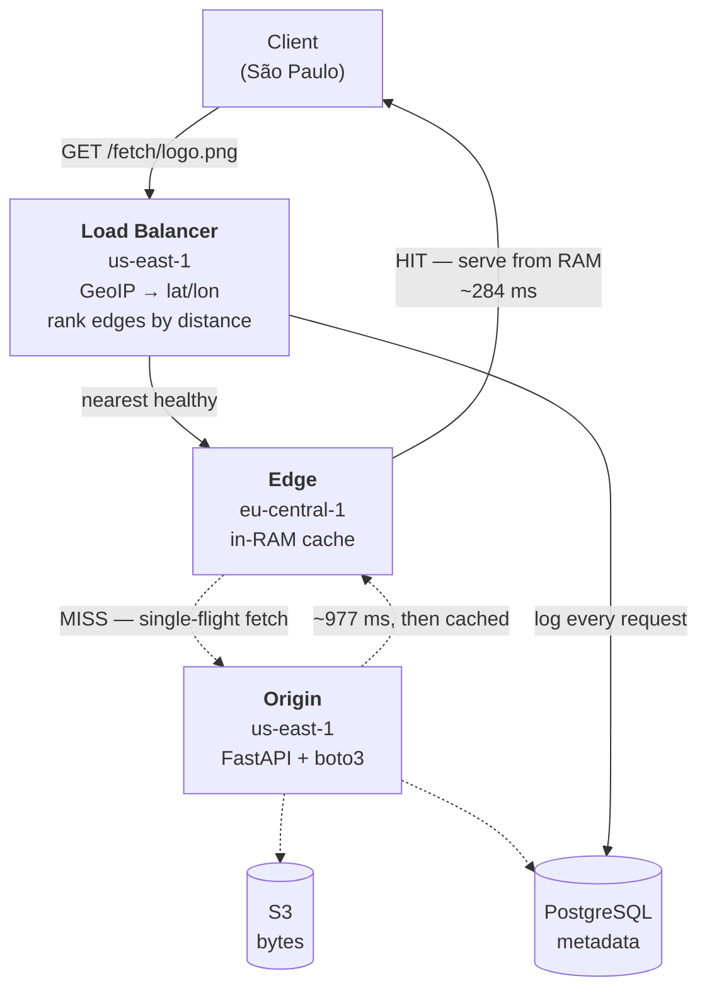
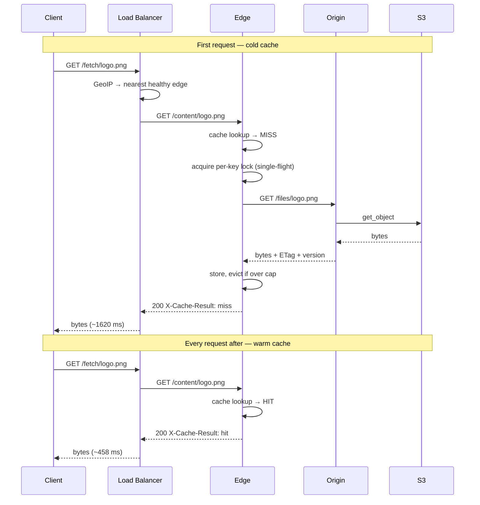
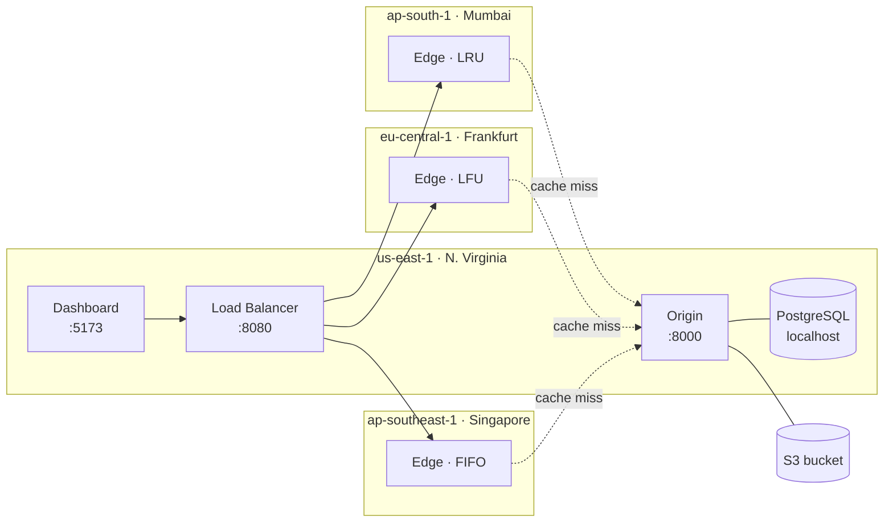

# Velocity CDN

**A content delivery network built from scratch — not a wrapper around CloudFront.**

One Origin holds the source of truth. Three Edge nodes on three continents hold
a bounded, lazily-populated cache. A Load Balancer resolves the client's real
location by IP and routes to the nearest healthy edge, failing over
automatically when one dies. Every request is logged and rendered live.

Running on four AWS EC2 instances in four real regions. **A cache hit is 3.5×
faster than a miss** — 458 ms vs 1620 ms at p50 across 541 requests from 24
client cities.


Follow the dots. Blue requests reach their nearest edge and turn straight back —
the bytes are already in that edge's memory. The orange one is a cache miss:
it has to cross to Virginia, and when it returns the edge **stores** what it got
(the ring pulse), so every later request for that key becomes a blue one.

---

## What it does

| | |
|---|---|
| **Geo-routing** | Real client IPs resolved through MaxMind GeoLite2, then ranked by great-circle distance. 33 client cities selectable for testing. |
| **Edge caching** | Bounded in-RAM cache per edge — hard byte cap, per-entry TTL, pluggable eviction (LRU / LFU / FIFO). |
| **Failover** | Health checks every 10 s; an unhealthy edge is dropped from routing and traffic walks to the next-nearest. |
| **Cache stampede protection** | 25 simultaneous requests for one uncached key produce exactly **one** origin fetch. |
| **Invalidation** | Updating or deleting a file pushes a purge to every edge, with per-edge success recorded. |
| **Stale-while-revalidate** | If the origin is down and an entry has expired, the edge serves the stale copy with `Warning: 110` rather than failing. |
| **Live dashboard** | Request feed over SSE, hit-ratio trend, per-region latency, edge health, file upload/delete. |

## Measured results

541 requests from 24 client cities, 12 concurrent. Server-side latency as
recorded by the Load Balancer, so the browser's own round trip is excluded.

| | p50 | p95 | n |
|---|---|---|---|
| **Cache hit** | **458 ms** | 1283 ms | 508 |
| **Cache miss** | 1620 ms | 3315 ms | 33 |

Per edge, the geography is visible in the data:

| Edge | Region | Hit p50 | Miss p50 | Speedup |
|---|---|---|---|---|
| edge-frankfurt | eu-central-1 | **284 ms** | 977 ms | 3.4× |
| edge-mumbai | ap-south-1 | 741 ms | 2009 ms | 2.7× |
| edge-singapore | ap-southeast-1 | 836 ms | 2003 ms | 2.4× |

Frankfurt is closest to the us-east-1 Origin, so its miss penalty is smallest.
Singapore is furthest and pays the most. Nobody programmed that ordering — it's
the speed of light through fibre, showing up in a database table.

**Throughput:** an edge serves **472 req/s** from cache on a t4g.micro. End to
end through the Load Balancer it's ~95 req/s, and that ceiling is
**network-bound, not CPU-bound** — concurrency past 10 only inflates latency,
because the Atlantic round trip dominates. That is the argument for the whole
architecture, stated as a measurement: you scale this by moving edges closer to
users, not by buying bigger instances.

**Verified behaviours**, each tested rather than asserted — method and raw
numbers in [benchmark.md](benchmark.md):

| Claim | Result |
|---|---|
| Single-flight prevents stampede | 25 concurrent misses → **1** origin fetch |
| Eviction respects the byte cap | 1 MB cap, 1.47 MB working set → occupancy held at 88%, LRU evicted correctly |
| Update invalidates every edge | Re-upload → all 3 edges served new content immediately |
| Failover on edge death | Detected in ~25 s, next request served by next-nearest, HTTP 200 |
| Stale-while-revalidate | Origin down + expired entry → served with `Warning: 110`; uncached key → 502 |

## Why this isn't a toy

The parts that would normally be a managed AWS service are the parts written
here by hand:

| Instead of | This project uses |
|---|---|
| CloudFront | A Load Balancer written in FastAPI — GeoIP resolution, haversine ranking, health checks, failover |
| Application Load Balancer | The same service. **No AWS ALB exists in this account** — routing decisions are application code, not console config |
| ElastiCache | An in-process cache per edge with a hard byte cap, TTL, and pluggable eviction |
| RDS | PostgreSQL installed directly on the Origin instance |

Deleting any of those in favour of the managed equivalent would delete the
thing worth explaining.

**Edges start empty and evict at a hard cap.** If every file fit in cache,
there'd be no cache to talk about.

## How a request flows



The dotted path runs **once per key per edge**. Every subsequent request for
that key takes the solid path and never touches the Origin at all — that's the
entire point of a CDN, and the 3.5× gap is the measurement of it.

### The four possible outcomes

| Result | Meaning | Client gets the file? |
|---|---|---|
| `hit` | Edge had it in memory, within TTL | ✅ fast |
| `miss` | Edge fetched from Origin, stored it, then served | ✅ slow |
| `stale` | TTL expired **and** Origin unreachable → old copy + `Warning: 110` | ✅ possibly outdated |
| `error` | 404 (no such file) or 502 (Origin down, nothing cached) | ❌ |

**A miss is not a failure.** Three of the four still deliver the file — a miss
just costs a round trip to Virginia. An entry becomes a miss when it's never
been requested at this edge, when its TTL expires, when it's evicted to make
room, or when the edge process restarts.

### Cache miss vs. hit, step by step



## Deployed topology



| Component | Region | Instance |
|---|---|---|
| Origin + Load Balancer + Dashboard | us-east-1 | t4g.micro |
| Edge — Mumbai (LRU) | ap-south-1 | t4g.micro |
| Edge — Frankfurt (LFU) | eu-central-1 | t4g.micro |
| Edge — Singapore (FIFO) | ap-southeast-1 | t4g.micro |

Three containers run on the us-east-1 box; each edge is one container on its own
instance in its own region. Every service is an independent FastAPI process with
its own memory — nothing is shared, so cache hits and misses are real rather
than simulated.

Origin is the only service holding database credentials; the Load Balancer and
Edges reach persisted state through Origin's `/internal/*` API. **Edges
self-register on boot** via `POST /internal/edges/register`, advertising their
own URL and coordinates, so a replaced instance rejoins without touching the
database.

**The Load Balancer is a single point in us-east-1**, which means a client in
São Paulo reaches Virginia before it reaches its local edge. Real CDNs avoid
that detour with anycast, where routing happens in the network layer rather than
in an application that has to live somewhere. It's the clearest structural
difference between this and CloudFront.

## The dashboard

Everything on it is live — no mock data, no seeded numbers.


**Try a request.** Click Fetch and every detail comes back immediately, without
scrolling anywhere: which edge served it, hit or miss, bytes, round trip, and
the request ID that correlates this request across all three services.


The city dropdown is generated by the Load Balancer using the *same*
`rank_edges()` the real routing path uses, so what it promises is what actually
happens — including when an edge goes unhealthy and drops out. Cities are
grouped by whether an edge is local, because the ones *without* a local edge are
what actually exercise nearest-edge selection.

**Origin files.** Upload and delete without touching a terminal. Uploads go
through Origin's API, which writes S3 and the metadata row together — the
`version` column is what invalidation compares against, and deleting pushes a
purge to every edge.

**Infrastructure.** Origin sits above the edges, matching the direction a cache
miss travels. It reports both hard dependencies separately (Postgres and S3), so
a half-broken Origin shows as `degraded` rather than a green light that lies.
Each edge shows its policy, occupancy against the byte cap, and hit ratio.

**Origin offload** is the tile that justifies the system: how many requests
reached Origin versus how many the edges absorbed.

The dashboard follows your system theme:


## Cache policies

`CachePolicy` is an interface ([`edge/app/cache/base.py`](edge/app/cache/base.py))
with `LRUPolicy`, `LFUPolicy`, and `FIFOPolicy` implementations. Each edge picks
one via the `CACHE_POLICY` env var — swapping it touches no routing or fetch
code. All three run simultaneously in production, one per edge, so a single
workload exercises every implementation.

Eviction is verified working: with a 1 MB cap and a 1.47 MB working set, LRU
evicted the least-recently-used entry, occupancy never crossed the cap, and each
eviction was logged with `reason=lru_evict`.

**The three policies currently report identical hit ratios, and that is not a
finding.** The production edges run a 200 MB cap against a ~15 MB working set,
so nothing is ever evicted — and with zero evictions LRU, LFU and FIFO are the
same code path. Making this a real comparison needs a working set that exceeds
`CACHE_MAX_BYTES`.

## GeoIP

Client IPs resolve to real coordinates via MaxMind GeoLite2 City, logged as
`resolution_method=geoip` with the resolved city. Verified routing:

| Client IP origin | Resolved as | Routed to |
|---|---|---|
| Google DNS (US) | US | edge-frankfurt |
| Telstra (Australia) | Childers, AU | edge-singapore |
| NIC.br (Brazil) | São Paulo, BR | edge-frankfurt |
| Telkom (South Africa) | Heidelberg, ZA | edge-mumbai |
| Jio (India) | IN | edge-mumbai |

South Africa routing to Mumbai rather than Frankfurt is correct — it's ~1,000 km
closer across the Indian Ocean.

The database is refreshed weekly by `geoipupdate` via `/etc/cron.weekly/`, which
also restarts the Load Balancer — `geoip.py` caches the reader for the process
lifetime, so a new file on disk isn't picked up until the process reopens it.

Without a database the service degrades cleanly rather than failing: it falls
back to Origin's home region, logs `resolution_method=geoip_unresolved`, and the
dropdown reads "Auto (GeoIP — disabled)" instead of silently pretending. Setup
instructions in [`geoip/README.md`](geoip/README.md).

## Running it locally

Requires Docker and Docker Compose.

```bash
docker compose up --build
```

Brings up Postgres, MinIO (stands in for S3), Origin, three Edges, the Load
Balancer, and the dashboard — each in its own container with its own memory.

- Dashboard — http://localhost:5174
- Load Balancer API — http://localhost:8080
- Origin API — http://localhost:8000
- MinIO console — http://localhost:9011 (`minioadmin` / `minioadmin`)

```bash
python3 scripts/seed_demo.py --count 20
curl "http://localhost:8080/fetch/demo/file-00.txt?region=mumbai" -D -
# run it twice — the second returns X-Cache-Result: hit
```

For sustained traffic:

```bash
pip install locust
locust -f scripts/locustfile.py --host http://localhost:8080
```

The workload is Zipf-distributed so a handful of files dominate — that's what
makes eviction-policy differences visible. Run it from a machine that isn't
hosting an edge, or you're measuring your own loopback.

## Where the interesting code is

| File | What's in it |
|---|---|
| [`load-balancer/app/routing.py`](load-balancer/app/routing.py) | Haversine distance + edge ranking. Failover is just walking this list. |
| [`load-balancer/app/routers/fetch.py`](load-balancer/app/routers/fetch.py) | The request path: resolve location → rank → try each edge → log. |
| [`edge/app/cache_manager.py`](edge/app/cache_manager.py) | TTL, byte cap, and the per-key `asyncio.Lock` that prevents cache stampede. |
| [`edge/app/cache/base.py`](edge/app/cache/base.py) | The `CachePolicy` interface the three eviction strategies implement. |
| [`load-balancer/app/edge_registry.py`](load-balancer/app/edge_registry.py) | Health-check loop and the in-memory view of the edge registry. |
| [`origin/app/purge.py`](origin/app/purge.py) | Invalidation push to every edge, with per-edge success tracking. |

```
origin/            FastAPI + Postgres (SQLAlchemy async) + S3 (boto3)
edge/              FastAPI + pluggable in-RAM cache (LRU/LFU/FIFO)
load-balancer/     FastAPI + GeoIP + routing/failover + health checks
frontend/          React + Tailwind + Recharts dashboard
db/init.sql        Schema — source of truth, run via psql
scripts/           Locust load test + demo-file seeder
docker-compose.yml Local stack (Postgres + MinIO + every service)
docs/images/       Dashboard screenshots and the flow diagram
DEMO.md            Walkthrough script for a video or live demo
benchmark.md       Measured results, methodology, caveats
SPEC.md            The design doc this was built from
```

## Limitations

Stated plainly, because every one of these is a question worth being able to
answer:

- **Not production-hardened.** Plain HTTP, security groups open to `0.0.0.0/0`,
  no auth on the admin or upload endpoints. Anyone with the URL can upload or
  delete. Fine for a demo; don't put anything real behind it.
- **The Load Balancer is a single point of failure** and a single geographic
  detour. Anycast is the real answer; this isn't that.
- **A single failed health check ejects an edge.** No consecutive-failure
  threshold, so a brief network blip causes a flap.
- **The cache-policy comparison isn't yet an experiment** — see above.
- **Published numbers are a scripted run, not a load test.** 541 requests from
  one laptop, not Locust from a dedicated generator in its own region.
- **Cache is in-process.** Restarting an edge empties it; there's no shared or
  persistent tier.
- **Postgres is co-located with Origin.** No network hop on the metadata path,
  but one instance dying takes both down, and backups are manual. Migrating to
  RDS is a connection-string change — same engine.
- **Uploads must go through `POST /files`.** Writing directly to the S3 bucket
  leaves no metadata row, and Origin will 404 the key even though the bytes
  exist.
