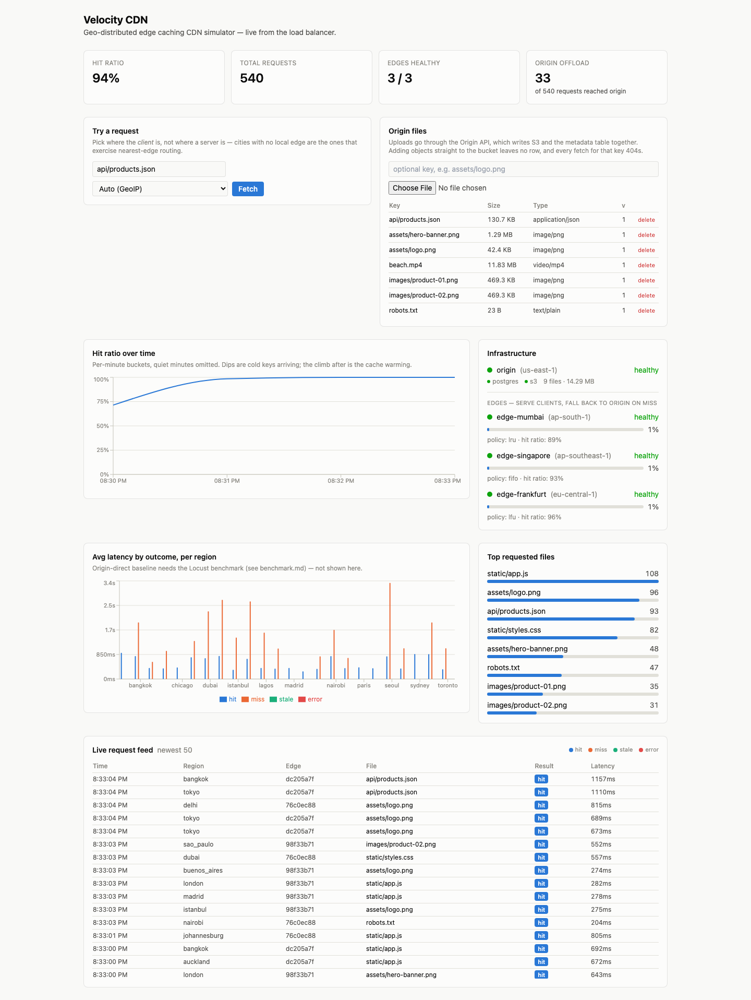
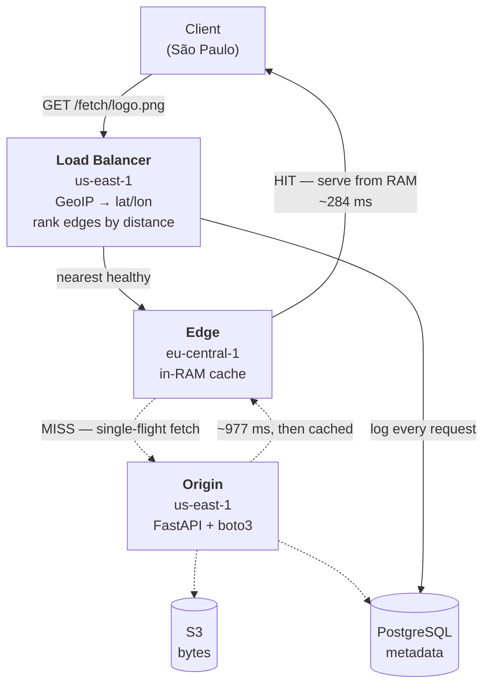
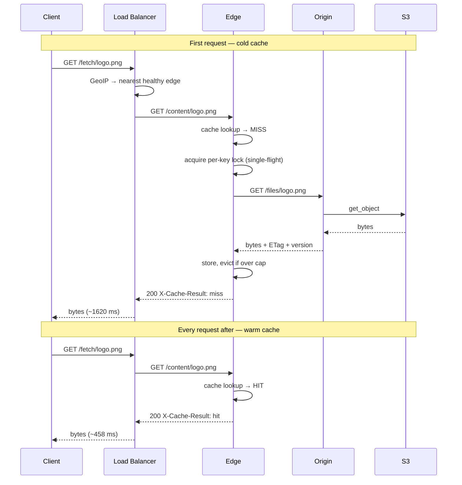
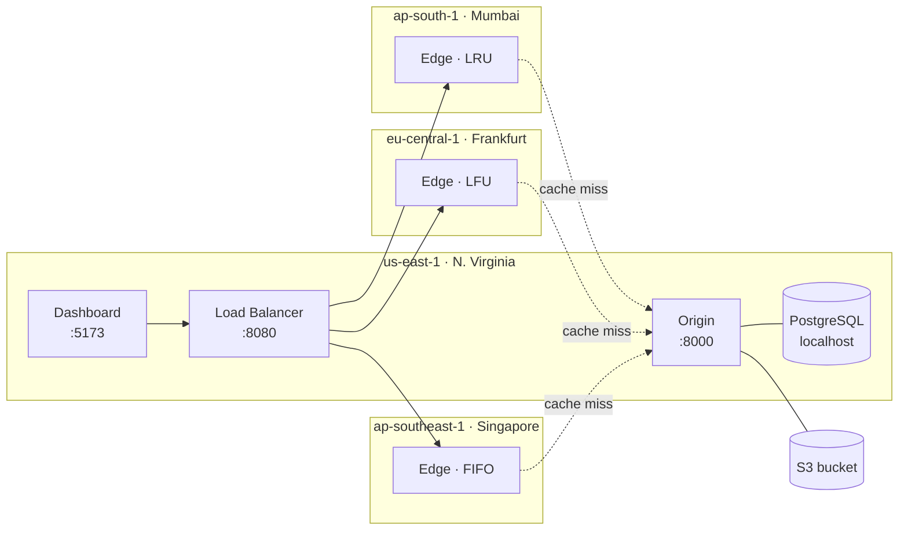
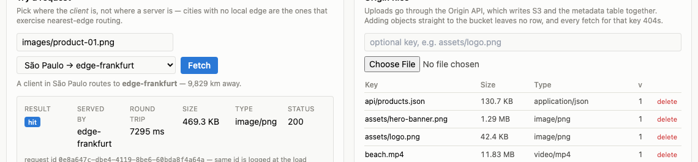
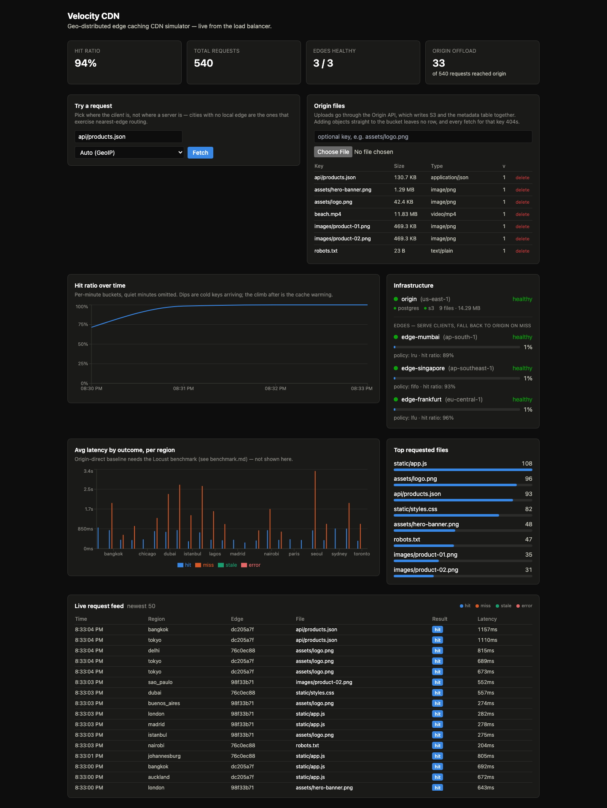

# Velocity CDN

**A content delivery network built from scratch — not a wrapper around CloudFront.**

One Origin holds the source of truth. Three Edge nodes on three continents hold
a bounded, lazily-populated cache. A Load Balancer resolves the client's real
location by IP and routes to the nearest healthy edge, failing over
automatically when one dies. Every request is logged and rendered live.

Deployed on four AWS EC2 instances in four real regions. **A cache hit is 3.5×
faster than a miss** — 458ms vs 1620ms at p50 across 541 requests from 24 client
cities.


Watch the two dots. The **blue** one is a cache hit — it stops at the edge and
turns around, because the edge already has the bytes in RAM. The **orange** one
is a miss: it has to continue to the origin and S3, then the edge stores what
came back (the ring pulse) so the *next* request for that key takes the blue
path instead. That difference, measured, is what the rest of this README is
about.



## Why this isn't a toy

The parts that would normally be a managed AWS service are the parts that are
written here by hand:

| Instead of | This project uses |
|---|---|
| CloudFront | A Load Balancer written in FastAPI — GeoIP resolution, haversine distance ranking, health checks, failover |
| Application Load Balancer | The same service. **No AWS ALB exists in this account** — routing decisions are application code, not console config |
| ElastiCache | An in-process cache per edge with a hard byte cap, TTL, and pluggable eviction (LRU/LFU/FIFO) |
| RDS | PostgreSQL installed directly on the Origin instance |

Deleting any of those in favour of the managed equivalent would delete the
thing worth explaining. That constraint came from the design doc
([SPEC.md](SPEC.md)) and was held to.

**Edges start empty and evict at a hard cap.** If every file fit in cache,
there'd be no cache to talk about.

## Measured results

541 requests from 24 client cities, 12 concurrent. Server-side latency as
recorded by the Load Balancer, so the browser's own round trip is excluded:

| | p50 | p95 | n |
|---|---|---|---|
| **Cache hit** | **458 ms** | 1283 ms | 508 |
| **Cache miss** | 1620 ms | 3315 ms | 33 |

Per edge, the geography is visible in the data:

| Edge | Region | Hit p50 | Miss p50 | Speedup |
|---|---|---|---|---|
| edge-frankfurt | eu-central-1 | **284 ms** | 977 ms | 3.4× |
| edge-mumbai | ap-south-1 | 741 ms | 2009 ms | 2.7× |
| edge-singapore | ap-southeast-1 | 836 ms | 2003 ms | 2.4× |

Frankfurt is closest to the us-east-1 Origin, so its miss penalty is smallest.
Singapore is furthest and pays the most. Nobody programmed that ordering — it's
the speed of light through fibre, showing up in a database table.

These figures include queueing from 12-way concurrency. A near-sequential run
measured earlier gave 218ms hit / 1152ms miss — better absolute numbers, smaller
sample. The larger, more contended run is published here because it's the more
conservative claim.

**Failover, measured:** killing the Singapore edge mid-run was detected in ~25s
and the next request was served by Mumbai instead — HTTP 200, no client-visible
error.

**Throughput:** an edge serves **472 req/s** from cache on a t4g.micro (416
req/s at 53 MB/s for 130KB files). End-to-end through the Load Balancer it's
~95 req/s, and that ceiling is **network-bound, not CPU-bound** — concurrency
past 10 only inflates latency, because the Atlantic round trip dominates. That
is the argument for the architecture stated as a measurement: you scale this by
moving edges closer to users, not by buying bigger instances.

Full methodology and caveats in [benchmark.md](benchmark.md).

## How a request flows



The dotted path runs **once per key per edge**. Every subsequent request for
that key takes the solid path and never touches the Origin at all — that's the
entire point of a CDN, and the 3.5× gap is the measurement of it.

### Cache miss vs. hit, step by step



## Deployed topology



Four `t4g.micro` instances. The Load Balancer, Origin, and Dashboard are three
Docker containers on the us-east-1 box; each edge is one container on its own
instance in its own region. **Each edge runs a different eviction policy**, so a
single workload exercises all three implementations at once.

Every service is an independent FastAPI process with its own memory — nothing
is shared, so cache hits and misses are real rather than simulated. Origin is
the only service holding database credentials; the Load Balancer and Edges
reach persisted state through Origin's `/internal/*` API.

## The dashboard

Everything on it is live — no mock data, no seeded numbers.

**Try a request.** Click Fetch and every detail comes back immediately, without
scrolling anywhere: which edge served it, hit or miss, bytes, round trip, and
the request ID that correlates this request across all three services.



Pick from **33 client cities worldwide**. The dropdown is generated by the Load
Balancer using the *same* `rank_edges()` the real routing path uses, so what it
promises is what actually happens — including when an edge goes unhealthy and
drops out. Cities are grouped by whether an edge is local, because the ones
*without* a local edge are what actually exercise nearest-edge selection.

**Origin files.** Upload and delete without touching a terminal. Uploads go
through Origin's API, which writes S3 and the metadata row together — the
`version` column here is what invalidation compares against, and deleting a file
pushes a purge to every edge.

**Infrastructure.** Origin sits above the edges, matching the direction a cache
miss travels. Origin reports both its hard dependencies separately (Postgres and
S3), so a half-broken Origin shows as `degraded` rather than a green light that
lies. Each edge shows its policy, live occupancy against the byte cap, and hit
ratio.

**Origin offload** is the tile that justifies the whole system: how many
requests actually reached Origin versus how many the edges absorbed.

The dashboard follows your system theme:



## Quick start (local)

Requires Docker + Docker Compose.

```bash
docker compose up --build
```

This brings up: Postgres, MinIO (S3-compatible, stands in for AWS S3 locally),
Origin, three Edges (Mumbai/Frankfurt/Singapore — same codebase, different
config, per the "no fake regions" rule even runs as separate containers with
separate in-memory caches), the Load Balancer, and the dashboard.

- Dashboard: http://localhost:5174
- Load Balancer API: http://localhost:8080
- Origin API: http://localhost:8000
- MinIO console: http://localhost:9011 (`minioadmin` / `minioadmin`)

Seed some demo files, then fetch one through the Load Balancer:

```bash
python3 scripts/seed_demo.py --count 20

curl "http://localhost:8080/fetch/demo/file-00.txt?region=mumbai" -D -
# second request for the same key should come back with X-Cache-Result: hit
```

Watch the dashboard's live feed light up as you run requests, or point
`scripts/locustfile.py` at it for sustained traffic (see below).

## Deployed topology (AWS)

| Component | Region | Instance | Notes |
|---|---|---|---|
| Origin + Load Balancer + Dashboard | us-east-1 | t4g.micro | Postgres installed on the box, S3 for bytes |
| Edge — Mumbai | ap-south-1 | t4g.micro | LRU |
| Edge — Frankfurt | eu-central-1 | t4g.micro | LFU |
| Edge — Singapore | ap-southeast-1 | t4g.micro | FIFO |

Edges self-register with Origin on boot via `POST /internal/edges/register`,
advertising their own public URL and coordinates — no manual seeding of the
`edges` table, and a replaced instance rejoins on its own.

Each edge runs a different eviction policy so a single workload exercises all
three simultaneously. Note that this only distinguishes them once the working
set exceeds `CACHE_MAX_BYTES` — see the caveat in [benchmark.md](benchmark.md).

**Not production-hardened.** Services are plain HTTP on port 8000/8080 with
security groups open to `0.0.0.0/0`, which is fine for a demo but is exactly
what Phase 3's Nginx + TLS + auth-gated admin endpoints exist to fix. Don't
put anything real behind it as-is.

### GeoIP

Live on the deployment: client IPs resolve to real coordinates via MaxMind
GeoLite2 City, and requests log `resolution_method=geoip` with the resolved
city (e.g. `Bengaluru, IN`). Verified routing:

| Client IP origin | Resolved as | Routed to |
|---|---|---|
| Google DNS (US) | US | edge-frankfurt |
| Telstra (Australia) | Childers, AU | edge-singapore |
| NIC.br (Brazil) | São Paulo, BR | edge-frankfurt |
| Telkom (South Africa) | Heidelberg, ZA | edge-mumbai |
| Jio (India) | IN | edge-mumbai |

South Africa routing to Mumbai rather than Frankfurt is correct — it's ~1,000km
closer across the Indian Ocean.

The database is refreshed weekly by `geoipupdate` via `/etc/cron.weekly/`, which
also restarts the load balancer (`geoip.py` caches the reader for the process
lifetime, so a new file on disk isn't picked up until the process reopens it).

**To set this up yourself:** free MaxMind account → generate a license key →
put your Account ID and key in `/etc/GeoIP.conf` with `EditionIDs GeoLite2-City`
and `DatabaseDirectory` pointing at the path bind-mounted to `/geoip` in the
load-balancer container. The `.mmdb` is licensed and gitignored, never committed.

Without a database the service degrades cleanly rather than failing: it falls
back to Origin's home region, logs `resolution_method=geoip_unresolved`, and the
dashboard's region dropdown labels the option "Auto (GeoIP — disabled)" instead
of silently pretending it resolved. The `?region=` manual override always works
regardless.

## Cache policies

`CachePolicy` is an interface (`edge/app/cache/base.py`) with `LRUPolicy`,
`LFUPolicy`, and `FIFOPolicy` implementations. Each edge picks one via
`CACHE_POLICY` env var — swapping it touches no routing or fetch code. The
default local compose file runs one of each (Mumbai=LRU, Frankfurt=LFU,
Singapore=FIFO) so pluggability is visible out of the box; a real policy
*comparison* (identical Zipf workload, same edge, hit-ratio table) is a
Phase 2 exercise — see [benchmark.md](benchmark.md).

## Load testing

```bash
pip install locust
python3 scripts/seed_demo.py --count 50
locust -f scripts/locustfile.py --host http://localhost:8080
```

Open http://localhost:8089, pick concurrency, and watch the dashboard. The
workload is Zipf-distributed (`scripts/locustfile.py`) so a handful of files
dominate traffic — that's what makes eviction-policy differences visible.
Run this from a machine that isn't hosting any edge, in production, to avoid
measuring your own loopback.

## Repo layout

```
origin/            FastAPI + Postgres (SQLAlchemy async) + S3 (boto3)
edge/              FastAPI + pluggable in-RAM cache (LRU/LFU/FIFO)
load-balancer/     FastAPI + GeoIP + routing/failover + health checks
frontend/          React + Tailwind + Recharts dashboard
db/init.sql        Schema (source of truth — run via psql in prod)
scripts/           Locust load test + demo-file seeder
docker-compose.yml Local dev stack (Postgres + MinIO + all services)
geoip/             GeoLite2-City.mmdb lands here (licensed, not committed)
docs/images/       Dashboard screenshots used in this README
SPEC.md            The design doc this was built from
DEMO.md            Walkthrough script for a video or live demo
benchmark.md       Measured results + methodology + caveats
```

## Where the interesting code is

If you're reading this to evaluate the engineering, these are the files worth
opening:

| File | What's in it |
|---|---|
| [`load-balancer/app/routing.py`](load-balancer/app/routing.py) | Haversine distance + edge ranking. Failover is just walking this list. |
| [`load-balancer/app/routers/fetch.py`](load-balancer/app/routers/fetch.py) | The request path: resolve location → rank → try each edge → log. |
| [`edge/app/cache_manager.py`](edge/app/cache_manager.py) | TTL, byte cap, and the per-key `asyncio.Lock` that prevents cache stampede. |
| [`edge/app/cache/base.py`](edge/app/cache/base.py) | The `CachePolicy` interface the three eviction strategies implement. |
| [`load-balancer/app/edge_registry.py`](load-balancer/app/edge_registry.py) | Health-check loop and the in-memory view of the edge registry. |
| [`origin/app/purge.py`](origin/app/purge.py) | Invalidation push to every edge, with per-edge success tracking. |

## Roadmap

- [x] Phase 1 — core CDN: upload/fetch, lazy cache w/ TTL + single-flight,
      GeoIP + manual-override routing, multi-edge + failover, invalidation
      push, dashboard, stale-while-revalidate.
- [x] Real 4-region AWS deployment — Origin us-east-1, edges ap-south-1 /
      eu-central-1 / ap-southeast-1, each on its own t4g.micro.
- [x] Live GeoIP via MaxMind GeoLite2, auto-refreshed weekly by `geoipupdate`.
- [x] Chaos/failover test with recorded before/after latency.
- [ ] Phase 2 — cache-policy comparison under a working set that actually
      exceeds capacity; Locust load run for p99s under concurrency;
      request-correlation trace view in the dashboard.
- [ ] Phase 3 — Prometheus + Grafana, auth-gated admin console, Nginx TLS
      termination in front of each service.
- [ ] Phase 4 — animated request-flow view.

## Known gaps (called out, not hidden)

- **The published numbers are a scripted run, not a load test.** 541 requests
  from a single laptop at 12-way concurrency, not Locust from a dedicated
  generator. Real p99s under sustained load need that generator on a 5th
  instance — the workload script is in `scripts/`.
- **The cache-policy comparison is not yet a real experiment.** All three edges
  report the same hit ratio because the working set fits under the 200MB cap,
  so nothing ever evicts, so LRU/LFU/FIFO behave identically. This is written up
  honestly rather than presented as a finding — see [benchmark.md](benchmark.md).
- **Not production-hardened.** Plain HTTP, security groups open to `0.0.0.0/0`,
  no auth on `/internal/admin/*`. Fixing that is Phase 3's entire purpose; don't
  put anything real behind this as-is.
- **Local dev uses MinIO** instead of real S3, and Postgres runs in Compose
  rather than on the Origin box. Both are env-var swaps, same engine either way.
- **Uploads must go through `POST /files`.** Writing directly to the S3 bucket
  leaves no row in the `files` table, and Origin will 404 the key even though
  the bytes exist — the database is the source of truth for checksum and version,
  which invalidation depends on.
- No auth on `/internal/*` endpoints — acceptable only because they're not
  meant to be internet-reachable (call them only from Origin/LB/Edge inside
  the VPC/compose network). Don't expose port 8000 on Origin publicly.
